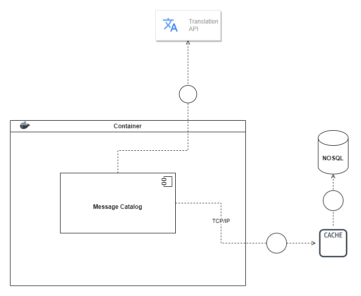

# Message Catalog UCO Documentation

## 1. Diseño de alto nivel

### 1.1. Restricciones de diseño

#### 1.1.1. Restricciones tecnicas

El problema debe de estar desarrollado en alguno de los siguientes frameworks: Django, Spring, .NET o Node

#### 1.1.2. Restricciones de negocio

La solucion del problema no peude implicar un costo adicional para la universidad

### 1.2. alternativa de solucion

#### 1.2.1 Arquitectura de referencia

#### Cache

Esta se utilizará para tener un facil acceso a los mensajes de la aplicacion, debido a su posible volumen de datos, la cache nos ayudara a reducr el costo en la transacción de consulta, debido a que no se tendra que hacer una consulta directa a la base de datos, ayudando a reducir el tiempo de respuesta entre solicitudes.

#### Base de datos No-SQL

- Las bases de datos No-SQL tiene una gran ventaja para el contexto de almacenar catalogos de mensajes debido a su escalamiento horizontal, lo que puede manejar grandes volumenes de datos y tráfico sin costo significativo de rendimiento, esto puede ser bastante util si los mensajes de las aplicaciones escalan rapidamente con el tiempo.
- Su flexibilidad nos ayuda a tener presente en el futuro posibles cambios en la estructura de los datos de cada aplicacion que se apoye de este microservicio, al no tener que definirse una estructura de datos rigida permite agregar nuevos atributos propios de cada aplicacion de forma independiente.
- Al tratarse de mensajes que se estan consultando en tiempo real las base de datos No-SQL permiten una lectura/escritura rapida.

#### Api de traduccion

- Al estar pensado para un acceso internacional, es necesario tener un componente que ayude a traducir los mensajes al idioma que la persona desee, ademas de que la gran mayoria de estas apis tienen una integracion sencilla.

#### 1.2.2. Arquetipo de referencia

#### 1.2.3. Plataforma tecnologica

#### Node.js

- Node.js esta diseñado para ser extremadamente rapido y eficiente, crucial en este componente ya que se debe manejar una gran cantidad de solicitudes concurrentes.
- Node.js utiliza un modelo E/S no bloqueante que permite a la aplicacón manejar multiples solicitudes simultaneas sin bloquear el hilo principal de ejecución, idela para aplicaciones altamente receptivas.
- Node.js puede manejar gran cantidad de conexiones simultaneas.
- Node.js cuenta con una comunidad activa de desarrolladores y un amplio ecosistema de módulos de código abierto que facilitan la integración de funciones adicionales.
- Node.js es agnostico en cuanto a base de datos, lo que permite la elección de una base de datos que mas se nos adapte a la solución.

#### Cassandra DB

- Cassandra permite una escalamiento horizontal, lo que permite que se puedan manejar grandes volumenes de datos y trafico, ademas si el microservicio de catalogo crece, se pueden agregar mas nodos para manejar la carga sin problema
- Cassandra es conocida por su alta disponibilidad y tolerancia a fallos. Esto garantiza que el microservico este siempre disponible.
- Cassandra permite la replicación de datos en varios nodos, lo que proporciona redundancia y resiliencia, se puede configurar la aplicación en diferentes ubicaciones geograficas para mejorar la disponibilidad y la recuperacion ante desastres.
- Ofrece una escritura rapida, lo que ayuda a guardar mensajes con un buen rendimiento.
- Se pueden realizar tecnicas de consulta para poder realizar consultas rapidas para recuperar mensajes de forma eficiente.
- Cassandra puede distribuir los datos en multiples centro de datos y ubicaciones geograficas, lo que garantiza el acceso rapido en todo el mundo.
- Cassandra se destaca en aplicaciones que requieren una alta carga de lectura/escritura y puede manejar muchas solicitudes simultáneas sin degradación del rendimiento.
- Cassandra ofrece controladores y herramintas que facilitan su integración en Node.js.

#### Redis

- Redis almacena datos en memoria, lo que permite un acceso rápido a la información, por tanto se requiere una latencia baja para entregar los mensajes de manera eficiente.
- Redis es altamente escalable y permite la implementación de clústeres y la replicación maestro-esclavo para manejar cargas crecientes, esto es indispensable si el microservicio debe de crecer para satisfacer la demanda.
- Redis se puede implementar para almacenar consultas frecuentes o resultados de busquedas, lo que permite reducir la carga a la base de datos y asi mejorar el rendimiento.
- Ofrece bibliotecas para su integracion con los lenguajes.
- Redis es eficaz en el almacenamiento y recuperación de datos mediante claves. Esto facilita la gestión y búsqueda de mensajes.
- La simplicidad de Redis en términos de modelo de datos y operaciones hace que sea una elección atractiva para aplicaciones en tiempo real, lo que reduce la complejidad en el desarrollo.

#### Libretranslate

- Es un proyecto open-source lo que reduce el costo e integracion del microservicio, ademas tiene una comunidad muy activa y el proyecto esta en constante actualización.

## 2. Diseño detallado

### 2.1. Vista logica

### 2.2. Vista implementacion

### 2.3. vista de procesos

### 2.4. Escenarios

### 2.5. Vista funcional
